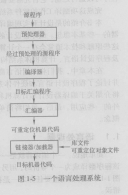

----------------------------------------------------
简单地说，一个编译器就是一个程序，他可以阅读以某一种语言编写的程序，并把该程序翻译成等价的、另一种语言编写的成雪。

编译器的重要任务之一是报告它在翻译过程中发现的源程序中的错误。

----------------------------------------------------

解释器是另一种常见的语言处理器。它并不通过翻译的方式生成目标程序，解释器直接利用用户提供的输入执行源程序中指定的操作。

在把用户输入映射成输出的过程中，由一个编译器产生的机器语言目标程序通常会比解释器快很多。然而，解释器的错误诊断效果通常比编译器更好，因为它逐个语句执行源程序。

----------------------------------------------------
Java语言处理器 结合了编译和解释的过程 
    Java代码 （编译）-> 中间码  （解释执行）-> 机器语言.

这样做的好处是在一台机器上编译得到的字节码可以在另一台机器上解释执行(跨平台).

just in time : 为了更快的完成输入到输出的处理，有些被称为JIT编译器的Java编译器在运行中间程序处理输入的前一刻把字节码翻译成机器语言，然后再执行程序.

----------------------------------------------------

## 一个语言处理系统：

一个源程序可能被分割为多个模块儿，并存放于独立的文件中。把源程序聚合在一起的任务有时会由一个被称为 <u>预处理器</u> 的程序独立完成. 预处理器还负责把那些称为宏的缩写形势转换为源语言语句。

大型程序经常被分成多个部分进行编译，因此，可重定位的机器代码有必要和其他可重定位的目标文件及库文件连接到一起，形成真正在机器上运行的代码。一个文件中的代码可能只想另一个文件中的位置，而连接器能够解决外部内存地址的问题。最后加载器把所有的可执行目标文件放到内存中执行。

