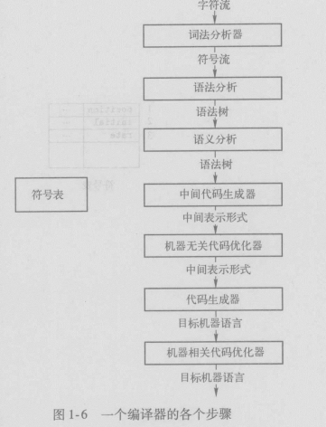
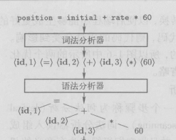

# 一个编译器的结构

编译器的结构可以粗略的分为两大部分 分析部分(前端) 和 综合部分(后端)。

分析部分把源程序分解成为多个组成要素，并再这些要素之上加上语法结构。然后它使用这个结构来创建该源程序的一个中间表示。如果分析部分检查出源程序没有按照正确的语法构成或者语义上不一致，它就必须提供有用的信息，使用户可以按此改成。分析部分还会收集有关源程序的信息，并把信息存放在一个称为符号表的数据结构中。符号便将和中间表达形式一起传送给综合部份。

综合部分根据中间标识和符号表的信息来构造用户期待的目标程序。

------------------------------------------

-------------------------------------------

## 1.2.1 词法分析
    编译器的第一个步骤称为词法分析(lexical analysis)。词法分析器读入组成源程序的字符流，并且将它们组织为有意义的词素(lexeme)序列。 对于每个词素 ，词法分析器产生如下形势的词法单元（token）作为输出: \<token-name> \<attribute-value> 。 

    这个词法单元中，第一个分量 token-name 是一个由语法分析步骤使用的抽象符号,而第二个分量attribute-value只想符号表中关于这个词法单元的条目。 

## 1.2.2 语法分析

    编译器的第二个步骤称为语法分析(syntax analysis)。语法分析器使用有词法分析器生成的各个词法单元的第一个分量来创建树形的中间表示。该中间表示给出了词法分析产生的词法单元流的语法结构。一个常用的表示方法是语法树，书中的每个内部节点代表一个运算，而该节点的子节点表示该运算的分量。

    语法分析的输入和输出

    

## 1.2.3 语义分析
    语义分析器使用语法树和符号表中的信息来检查源程序是否和语言定义的语义一致。它同时也收集类型星系，并把这些信息存放在语法树或结构表中，以便在随后的中间代码生成过程中使用。

    语义分析的一个重要部分是类型检查（type checking）

## 1.2.4 中间代码生成

    在源程序的语法分析和语义分析完成之后，很多编译器生成一个明确的低级的或类机器语言的中间表示。该中间表示应该与有两个重要的性质：他应该易于生成，且能够被轻松的翻译为目标机器上的语言。

## 1.2.5 代码优化
    机器无关的代码优化步骤试图改进中间代码，以便生成更好的目标代码。“更好”通常意味着更快，但是也可能会有其他目标。如更短的或能耗更低的目标代码。

## 1.2.6 代码生成
    代码生成器以源程序的中间表示形式作为输入，并把它映射到目标语言。如果目标语言是机器代码，那么就必须为程序使用的每个变量选择寄存器或内存位置。然后，中间直流被翻译成为能够完成相同任务的机器指令序列。代码生成的一个至关重要的方面是合理分配寄存器以存放变量的值。

## 1.2.7 符号表管理
    编译器的重要功能之一是记录源程序中使用的变量名字，并收集每个名字的各种属性。

## 1.2.8 将多个步骤组合成趟
    前面关于步骤的讨论讲的是一个编译器的逻辑组织方式。在一个特定的实现中，多个步骤的活动可以被组合成一趟。每趟读入一个输入文件并产生一个输出文件，

## 1.2.9 编译器的构造工具
    和任何软件开发者一样，写编译器的人可以充分利用现代的软件开发环境。这些环境中包含了诸如语言编辑器、调试器、版本管理、程序描述器、测试管理等工具。除了这些通用的软件开发工具，人们还创建了一些更加专业的工具来实现编译器的不同阶段。
