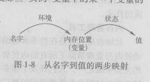

# 程序设计语言基础

## 1.6.1 静态和动态的区别
在为一个语言设计一个编译器时，我们所面对的重要问题之一是编译器能够对一个程序做出哪些判断。如果一个语言使用的策略志超编译器静态决定某个问题，那么我们说这个语言使用了一个静态策略，或者说这个问题可以额在编译时刻决定。 另一方面，一个只允许在运行程序时候做出决定的策略称为动态策略，或者被认为需要在运行时刻做出决定。

另一个需要注意的问题是声明的作用域。

x的一个声明的作用域是指程序的一个区域，在其中对x的使用都指向这个声明。

如果只通过阅读程序就可以确定一个声明的作用域，那么这个语言使用的是静态作用域，或者说语法作用域。否则这个语言使用的是动态作用域。 大部分语言都使用静态作用域。

## 1.6.2 环境与状态

名字和内存（存储）位置的关联，及之后和值的关联可以用两个映射来描述。这两个映射随着程序的运行而改变。

    1）环境（environment） 是一个从名字到存储位置的映射。
    2）状态（state）是一个从内存位置到它们值的映射。

## 1.6.3 静态作用域和块结构

包括C语言和它的同类语言在内的大多数语言都是用静态作用域。C语言的作用域规则是基于程序结构的，一个声明的作用域由该声明在程序中出现的位置隐含的决定。稍后出现的语言，比如C++、 Java 和 C# ，也通过注入public 、private和protected等关键字的使用，提供了对作用域的明确控制。

    C语言的静态作用域策略可以概括如下：
    1）一个C程序由一个顶层的变量和函数声明的序列组成。
    2）函数内部可以声明变量，变量包括局部变量和参数。每个这样的声明的作用域被限制在他们所出现的那个函数内。
    3）名字x的一个顶层声明的作用域包括随其后的所有程序。但是如果一个函数中也有一个x的声明，那么函数中的那些语句就不在这个顶层声明的作用域内。

## 1.6.4 显式访问控制
    看原书

## 1.6.5 动态作用域
如果一个作用域策略依赖于一个或者多个只有在程序执行时刻才能知道的因素，它就是动态的。

